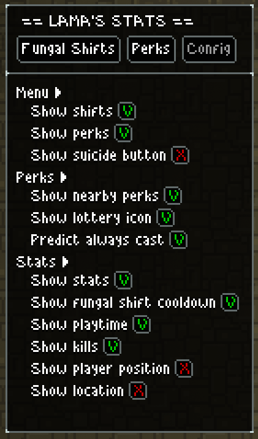
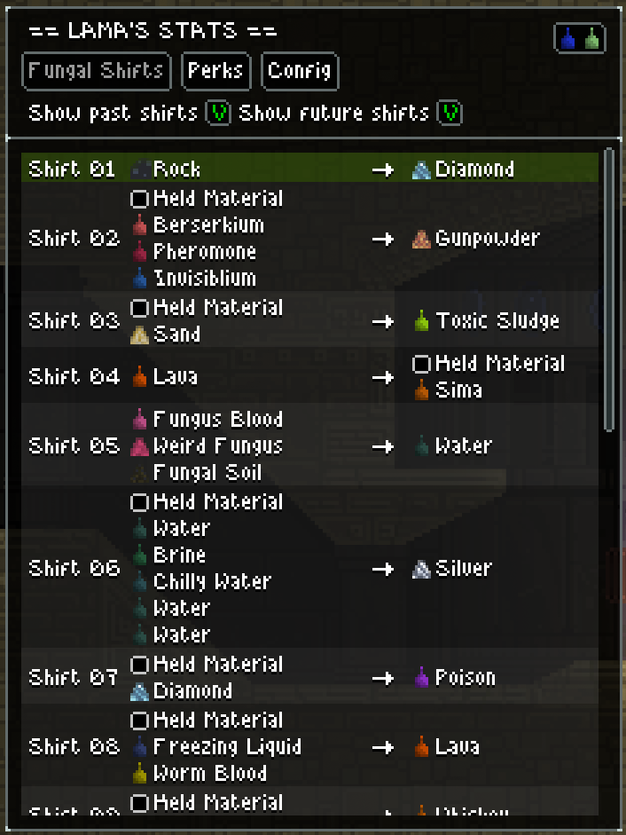
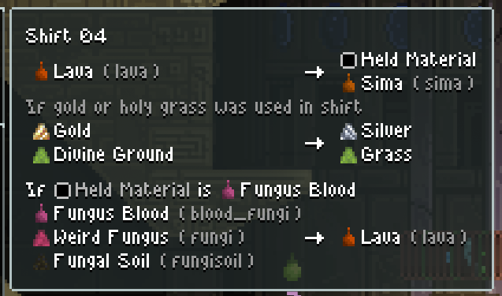

# Lama's Stats
Because I'm tired of inconsistencies between different mods.  
Almost everything is togglable and can be disabled.  
By default this mod only serves as a QOL mod, but can be further expanded into an in-game noitool.  

### Installation

- Press the [Download](https://github.com/lamia-zamia/lamas_stats/archive/refs/heads/main.zip) button
- Extract the contents into your Noita `mods` folder.
- Rename the folder from `lamas_stats-main` to `lamas_stats`.

Alternatively, subscribe to the mod on the [Steam Workshop](https://steamcommunity.com/sharedfiles/filedetails/?id=3273702268)

## Basic functions
* Show various stats on overlay, togglable by hotkey
* Show previous fungal shifts including results with flask
* Show fungal shift cooldown
* Show nearby and owned perks in a more convenient window (late-game QOL)
* Suicide button if you become too OP
## Predicting functions
* Show next fungal shifts including flask resolutions
* Predict failed shifts including nested fails
* Show AP/LC recipes
* Show perks in next holy mountain
* Show perks reroll results
* Show perk lottery result
* Show result of an always-cast perk
## Compatibility
* Should be compatible with most mods that adds perks or materials
* Should be loaded last (this mod only reads data from game)
* Now compatible with Apotheosis!

## Showcase

  
Settings

  

  
Fungal shift interface

  

  
Fungal shift tooltip

  

  
AP/LC Recipe

  

  
Perks interface

  

  
## Localization
* English
* Russian (including modded)
* Japanese (including modded)

## Credits
* [Kaedenn](https://github.com/Kaedenn) for code review and his [Fungal Shift Query](https://github.com/Kaedenn/noita-shift-query) for inspiring me to start this project
* [Nathan](https://github.com/NathanSnail) for [luanxml](https://github.com/NathanSnail/luanxml) and inspirations
* [Horscht](https://github.com/TheHorscht) for sharing his code and advises
* [Noita discord server](https://discord.gg/SZtrP2r) community for all the help during the development